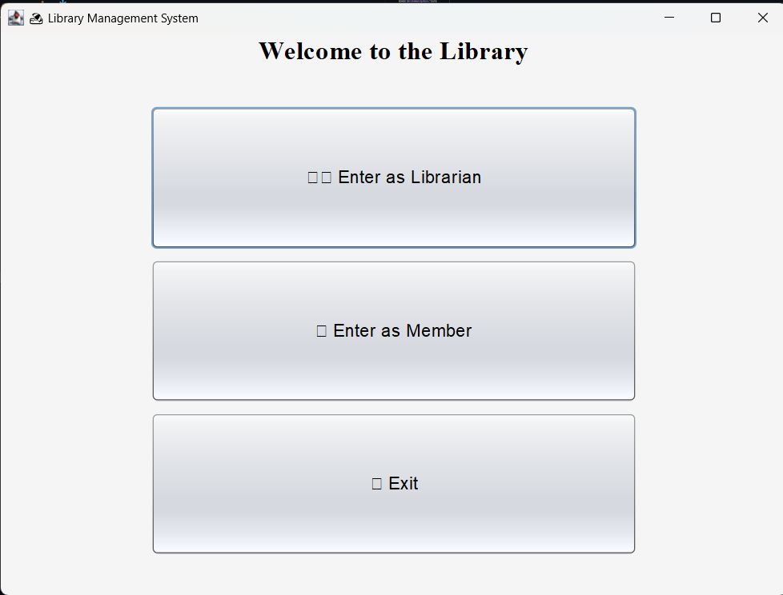
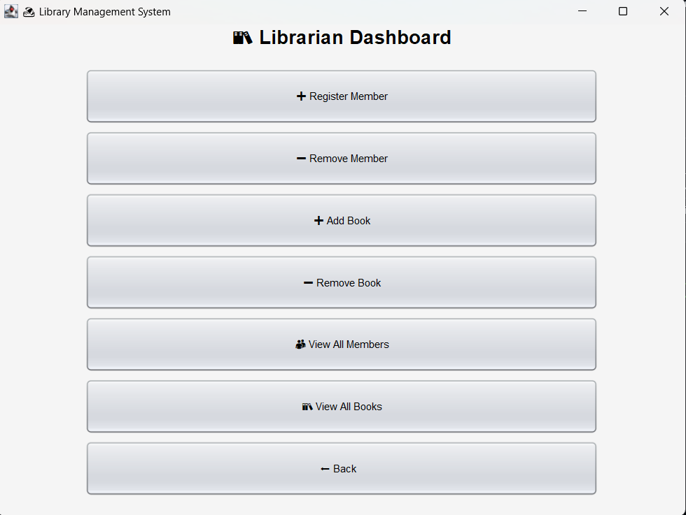
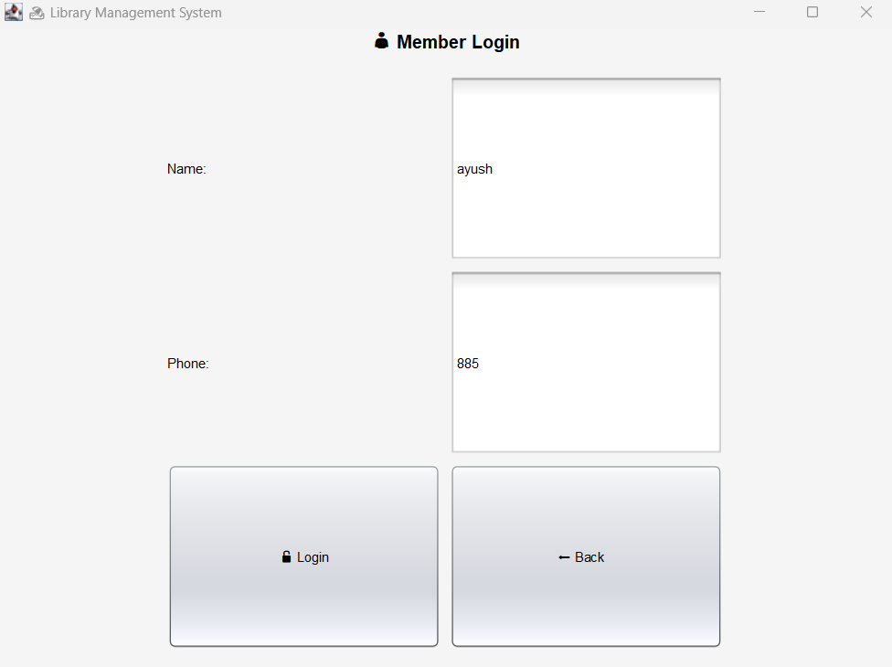
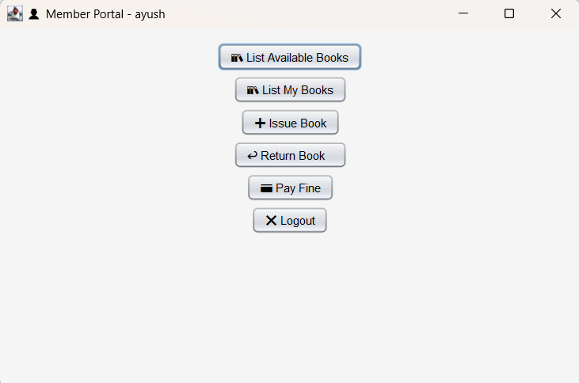

# 📚 Library Management System

A simple Java-based **Library Management System** that supports **both CLI and GUI** interaction modes. Designed to handle essential library operations such as managing members, books, and borrow/return activities.

---

## 🧭 Overview

This project simulates the operations of a real-world library using core Java concepts such as:
- Object-Oriented Programming (OOP)
- Collections (like `HashMap`, `ArrayList`)
- Swing-based GUI (`LibraryGUIApp.java`)
- Command-Line Interface (`LibrarySystem.java`)

---

## 📁 Files

| File Name            | Description                                                                 |
|---------------------|-----------------------------------------------------------------------------|
| `LibraryGUIApp.java` | Java Swing-based GUI Application providing interactive panels for users.   |
| `LibrarySystem.java` | Command-line interface version of the library system.                      |
| `Member.java`        | Represents a member, with personal info and a list of borrowed books. |
| `Book.java`          | Represents a book with ID, title, author, and available copies.            |
| `BorrowedBook.java`  | Tracks each borrowed book along with its due date and issue date.          |
| `User.java`          | Superclass containing shared attributes like `name` and `phone`.         |
| `Person.java`        | interface for common member and librarian person methods|
| `Librarian.java`     | Represents a librarian with privileges to manage books and members.        |

---

## 👤 Member Functionalities

A registered member can:

- 🔍 **View Available Books**  
  Lists all books with title, author, available copies, and ID.

- 📕 **List My Borrowed Books**  
  Shows books currently borrowed by the member.

- ➕ **Issue a Book**  
  Borrow a book by entering its ID, if available and no fine is due.

- ↩️ **Return a Book**  
  Return a book using its ID. If overdue, a fine is calculated.

- 💳 **Pay Fine**  
  Clear any pending dues before issuing a new book.

- ❌ **Logout**  
  Exit from member portal.

---

## 👨‍🏫 Librarian Functionalities

Librarians can:

- ➕ **Register Member**  
  Add a new member with name, age, and phone number.

- ➖ **Remove Member**  
  Remove a member using their phone number.

- ➕ **Add Book**  
  Enter book title, author, and number of copies to add a new book.

- ➖ **Remove Book**  
  Remove a book from the system using its ID.

- 👥 **View All Members**  
  Display member details including their borrowed books.

- 📚 **View All Books**  
  Lists all books in the library with their current availability.

- ⬅️ **Back to Home**  
  Return to the home page.

---

## 💡 Features

- Unique IDs for each book and member.
- Borrowing system with automatic fine calculation.
- Book availability tracking.
- Dual interfaces: GUI and CLI.
- Neat code structure for scalability.

---

## 🖼️ GUI

  
  
  

